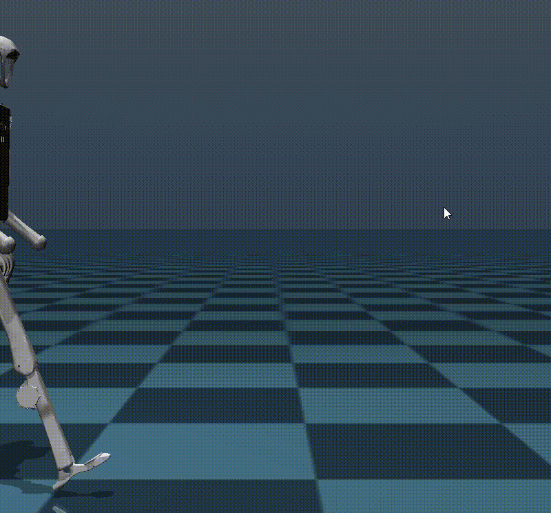
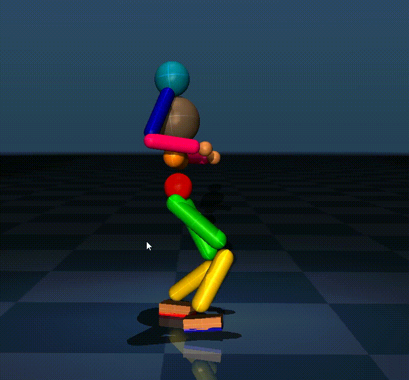
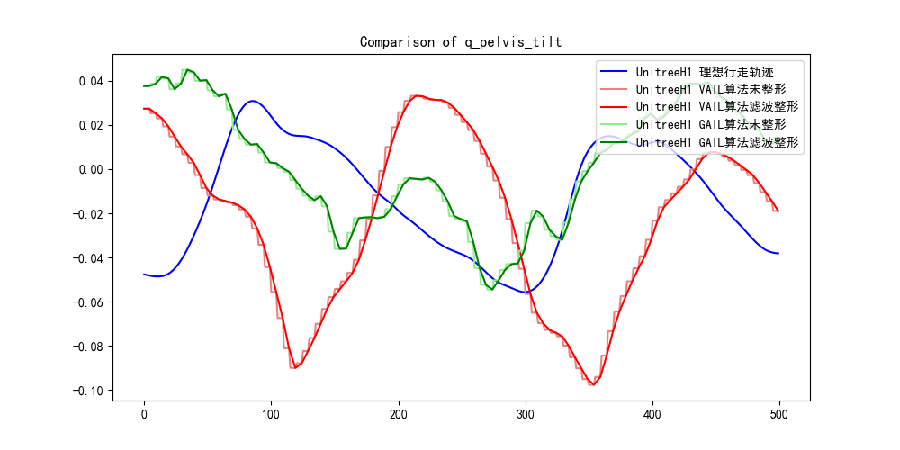
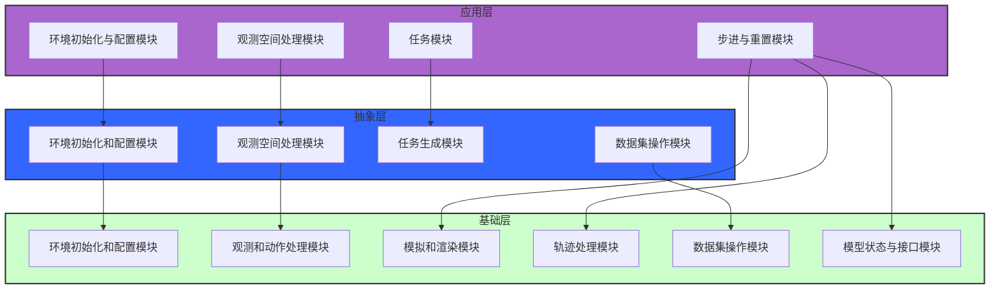

# olympic-mujoco


本项目是一个基于Mujoco的仿真人形机器人平台，采用三层架构设计，包括基础层、抽象层和应用层，以模拟多种机器人的行为和性能。平台支持模仿学习和强化学习训练，并具备理想轨迹可视化功能，为机器人技术的研究和开发提供了一个高效、灵活的仿真环境。


## 🔥 运行

**创建虚拟环境**

```
python -m venv venv
```

**windows**

```
.\venv\Scripts\activate
set PYTHONPATH=.;%PYTHONPATH%
```

**ubuntu**

```
source venv/bin/activate
```

**依赖**

```
pip3 install torch torchvision torchaudio --index-url https://download.pytorch.org/whl/cu121
```

```
pip install -r requirements.txt
```

### example

**理想轨迹可视化**

windows

```shell
python examples\play_walking_trajectory\test.py
```

ubuntu

```
python examples/play_walking_trajectory/test.py
```

示例代码

```python
from olympic_mujoco.environments.loco_env_base import LocoEnvBase

def experiment(seed=0):

    mdp = LocoEnvBase.make("UnitreeH1.walk.real")

    mdp.play_trajectory_from_velocity(n_episodes=3, n_steps_per_episode=500)

if __name__ == '__main__':
    experiment()
```

**ppo算法训练**

```
python examples/reinforcement_learning_ppo/a3/train_a3_walk.py
```

```
python examples/reinforcement_learning_ppo/a3/show_a3_walk.py
```

**模仿学习训练**

```
python examples/imitation_learning/launcher.py
```

**模仿学习评估**

```
python examples/evaluate_imitation_learning/evaluate_viewer.py
python examples/evaluate_imitation_learning/evaluate_save_npz.py
python examples/evaluate_imitation_learning/npz_plt.py
```

## 🌟效果

### 理想行走轨迹可视化



### PPO算法人形机器人行走



###  模仿学习GAIL、VAIL算法人形机器人行走


### 模仿学习效果分析



## 📝待办

- [ ] 重构整个项目


## 🔆 想法

1. **`LocoEnvBase`类**：
   - 这个类应该包含与MuJoCo环境交互的通用方法，如环境的初始化、渲染、步骤函数、重置环境等。
   - 可以定义一些抽象方法或接口，这些方法在子类中必须被实现，以确保所有的机器人操作类都具备某些核心功能。
2. **`BaseHumanoidRobot`类**：
   - 这个类继承自`LocoEnvBase`，应该包含所有 humanoid robot 的通用特性，例如：行走、跑步、跳跃等基础动作方法。
   - 可以在这个层面构思一些创建新数据集的方法，例如记录运动轨迹、速度、加速度等数据的方法。
3. **`UnitreeH1`类**：
   - 这个类继承自`BaseHumanoidRobot`，应该包含特定于`UnitreeH1`机器人的实现细节，比如它的机械结构、传感器数据读取、特有的动作等。
   - 对于一些特定的方法，比如与`UnitreeH1`硬件相关的控制接口，应该在这里实现。


`ObservationHelper` 类的功能：

- 管理和操作观测数据。
- 定义观测空间，包括身体、关节和站点的位置、旋转和速度。
- 提供添加、删除或检索特定观测的方法。
- 构建完整的观测数组。
- 允许根据观测修改 MuJoCo 数据，以影响模拟。

`MujocoRobotInterface` 类的功能：

- 提供了对 MuJoCo 模型和数据结构的直接访问。
- 提供了获取机器人质量、关节位置、速度、加速度等基本信息的方法。
- 提供了获取和设置关节速度限制、齿轮比率、执行器名称等参数的方法。
- 提供了获取脚部与地面接触信息的方法。
- 提供了获取和设置执行器扭矩的方法。
- 提供了单步模拟的方法。

功能对比：

- `ObservationHelper` 更专注于构建和操作观测数据，以适应强化学习中的观测空间需求。
- `MujocoRobotInterface` 提供了更广泛的机器人模拟和交互功能，包括获取传感器数据、设置控制参数、模拟步进等。


```python
class MujocoRobotInterface(object):

    def __init__(self, model, data, rfoot_body_name=None, lfoot_body_name=None):
```

由于这里使用`rfoot_body_name`和`lfoot_body_name`作为参数，所以**该类应在UnitreeH1类中实例化使用**。


### mujoco viewer

现在的版本使用的是mushroom rl的模型加载类,可能是这个原因导致无法正确加载模型的mesh

经过测试发现mujoco的原生viewer是可以正确加载的

TODO: 所以后续尝试修改模型的加载方式


```
python -m mujoco.viewer --mjcf=
```


### 多mujoco模型管理

​	第一段代码：
```python
self._models = [self.load_model(f) for f in xml_files]
self._current_model_idx = 0
self._model = self._models[self._current_model_idx]
```
这里做的事情是：
1. `self._models` 是一个列表，它通过列表推导式从一系列的XML文件中加载了多个模型。假设`self.load_model(f)`是一个方法，它接受一个XML文件的路径`f`作为参数，并返回一个加载好的MuJoCo模型对象。

2. `self._current_model_idx` 被初始化为0，这通常用作当前选定模型的索引。

3. `self._model` 被设置为列表中的第一个模型，即`self._models[0]`。
    这段代码的目的是为了在一个环境中管理多个模型，需要在不同时间点切换不同的模型。

  

  第二段代码：
```python
self.model = mujoco.MjModel.from_xml_path(fullpath)
```
这里做的事情是：
- 这行代码从一个指定的XML文件路径`fullpath`加载了一个单一的MuJoCo模型，并将其赋值给`self.model`属性。这个属性通常代表当前环境的唯一模型。

  

  区别：
1. **数量**：第一段代码加载了多个模型，而第二段代码只加载了一个模型。
2. **上下文**：第一段代码是为了在一个循环或选择过程中使用不同的模型，而第二段代码是在初始化时简单地加载了一个模型。
3. **管理**：第一段代码提供了一个索引和模型列表，允许在模型之间切换；第二段代码只是加载了一个模型，没有提供切换机制。
总结来说，第一段代码提供了一个模型管理机制，允许动态选择和切换多个模型，而第二段代码是一个单一的模型加载操作，适用于只需要一个模型的情况。


### 区分模仿学习和强化学习的实现


```python
from enum import Enum, auto

class AlgorithmType(Enum):
    REINFORCEMENT_LEARNING = auto()
    IMITATION_LEARNING = auto()
```

```python
 self.algorithm_type = algorithm_type
 if self.algorithm_type == AlgorithmType.REINFORCEMENT_LEARNING:
	self.setup_for_reinforcement_learning()
 elif self.algorithm_type == AlgorithmType.IMITATION_LEARNING:
     self.setup_for_imitation_learning()
 else:
     raise ValueError("Unsupported algorithm type")
```


## 🛠️项目架构

本项目采用三层架构设计，包括基础层、抽象层和应用层。每一层负责不同的功能模块，确保系统的模块化和扩展性。




## 🍀 致谢

- **LocoMujoco**
  - 作者: robfiras
  - 项目地址: [GitHub](https://github.com/robfiras/loco-mujoco)
  - 描述: LocoMujoco 是一个基于 Mujoco 物理引擎的开源项目，专注于机器人运动控制和仿真，提供了高效的物理模拟和灵活的控制接口。
  - 许可证: [MIT License](https://github.com/robfiras/loco-mujoco/blob/master/LICENSE)
- **LearningHumanoidWalking**
  - 作者: rohanpsingh
  - 项目地址: [GitHub](https://github.com/rohanpsingh/LearningHumanoidWalking)
  - 描述: LearningHumanoidWalking 是一个研究项目，旨在通过机器学习技术优化双足机器人的行走步态，实现更自然和高效的行走模式。
  - 许可证: [MIT License](https://github.com/rohanpsingh/LearningHumanoidWalking/blob/master/LICENSE)


